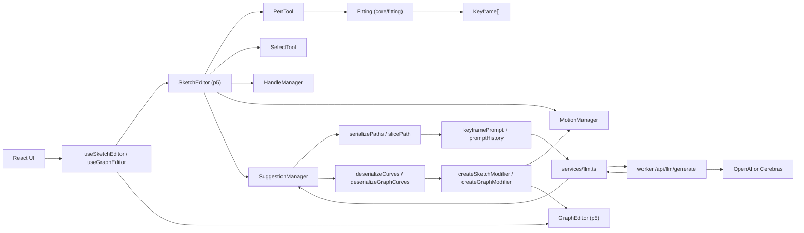

# MoPhrase Architecture

MoPhrase は、手描き入力をキーフレーム化して編集し、必要に応じて LLM 提案を差分（Modifier）として適用する Web ベースのモーショングラフィックスエディタである。

## 1. レイヤ構造

1. UI レイヤ（React）
- 入口: `src/main.tsx`
- 主要コンポーネント: `src/components/Canvas.tsx`, `src/components/Sidebar.tsx`, `src/components/Playback.tsx`, `src/components/Suggestion.tsx`
- 役割: 画面レイアウト、ユーザー入力、Editor への命令ルーティング

2. アプリケーションレイヤ（Hooks + Editor）
- Hooks: `src/hooks/useSketchEditor.ts`, `src/hooks/useGraphEditor.ts`
- Editor: `src/editor/sketchEditor/editor.ts`, `src/editor/graphEditor/editor.ts`
- 役割: UI 状態と p5 エンジンの橋渡し、操作単位のワークフロー制御

3. ドメインレイヤ（Core / Suggestion / Utils）
- Core: `src/core/fitting/*`, `src/core/motionManager.ts`, `src/core/handleManager.ts`
- Suggestion: `src/suggestion/*`
- Utils: `src/utils/keyframes.ts`, `src/utils/bezier.ts`, `src/utils/modifier.ts`, `src/utils/path.ts`, `src/utils/serialization/*`
- 役割: キーフレーム生成、曲線評価、選択範囲管理、提案適用、シリアライズ

4. API レイヤ（Worker）
- `worker/src/index.ts`
- 役割: `/api/llm/generate` の提供、OpenAI/Cerebras への Structured Output 中継

## 2. 全体図

## 3. 主要データフロー

### 3.1 手描き入力からキーフレーム生成

1. `PenTool` がドラッグ点列とタイムスタンプを収集（`src/editor/sketchEditor/penTool.ts`）。
2. `generateKeyframes` が以下を実行（`src/core/fitting/keyframes.ts`）。
- スケッチ曲線フィッティング（`fitSketchCurves`）
- 時間正規化（`time`）と距離正規化（`progress`）
- グラフ曲線フィッティング（`fitGraphCurves`）
3. `Path` として `SketchEditor` に追加され、アクティブ化される。

### 3.2 選択・編集

1. `SelectTool` がパスヒット判定、矩形選択、ハンドルドラッグを処理（`src/editor/sketchEditor/selectTool.ts`）。
2. `HandleManager` がアンカー/ハンドル選択状態と `SelectionRange` を計算（`src/core/handleManager.ts`）。
3. `SelectionRange` は提案対象区間の特定に再利用される。

### 3.3 LLM 提案生成と適用

1. `SuggestionManager.submit` が対象パスを `slicePath` で局所化（`src/utils/path.ts`）。
2. `serializePaths` が LLM 入力形式へ変換（`src/utils/serialization/curves.ts`）。
3. `fetchSuggestions` が `keyframePrompt` と履歴を組み合わせ、`generateStructured` を呼ぶ（`src/suggestion/suggestionService.ts`, `src/services/llm.ts`）。
4. Worker がプロバイダに問い合わせ、JSON を返却（`worker/src/index.ts`）。
5. 返却キーフレームを `deserializeCurves` / `deserializeGraphCurves` で曲線化し、元曲線との差分を `Modifier` として生成（`src/utils/modifier.ts`）。
6. `Path.sketchModifiers` / `Path.graphModifiers` に蓄積し、強度スライダで再調整する。

### 3.4 再生・プレビュー

1. `MotionManager` が全パスの空間曲線/時間曲線を構築（`buildSketchCurves`, `buildGraphCurves`）。
2. `applyModifiers` を適用後、時間から進行度を求めて位置を評価（`src/core/motionManager.ts`）。
3. `Playback` UI は `PlaybackController` 経由で再生、シーク、最終フレーム移動を操作（`src/components/Playback.tsx`）。

### 3.5 保存・読込

1. `serializeProject` が `Path[] + ProjectSettings` を JSON 化（`src/utils/serialization/project.ts`）。
2. File System Access API で保存・読込（`src/hooks/useSketchEditor.ts`）。
3. 読込時は `deserializeProject` → `applySerializedProject` で復元。

## 4. データ境界

- 画面編集の内部表現: `Path`, `Keyframe`, `Vector`（`src/types.ts`）
- LLM 境界の表現: `SerializedPath`, `SerializedKeyframe`, `SerializedHandle`（`src/types.ts`）
- LLM 応答検証: `suggestionResponseSchema`（`src/types.ts`）

## 5. 設計上の不変条件

- `Keyframe` の順序と接続順を維持する。
- `time` は 0-1 の正規化時刻として扱い、ロード時に単調増加へ補正する。
- LLM 提案は上書きではなく `Modifier` 差分として合成する。
- スケッチ編集とグラフ編集は分離しつつ、`progress` を介して同期する。
- 設定永続化では `keyframePrompt` を除外し、実行時に `raw` 読み込みする（`src/services/configStorage.ts`, `src/config.ts`）。

## 6. 変更時の着眼点

- 描画・選択ロジック変更: `src/editor/sketchEditor/*`, `src/core/handleManager.ts`
- 時間カーブ挙動変更: `src/editor/graphEditor/editor.ts`, `src/utils/keyframes.ts`
- 提案品質/契約変更: `src/prompts/keyframePrompt.md`, `src/types.ts`, `src/suggestion/*`, `worker/src/index.ts`
- 保存形式変更: `src/utils/serialization/project.ts`, `src/utils/serialization/curves.ts`

